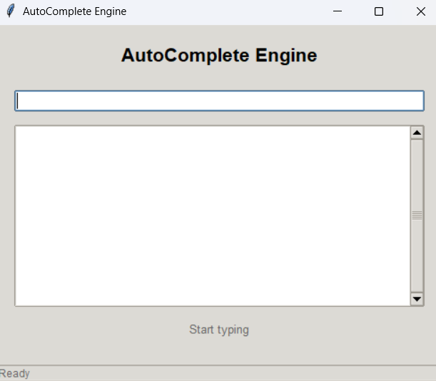
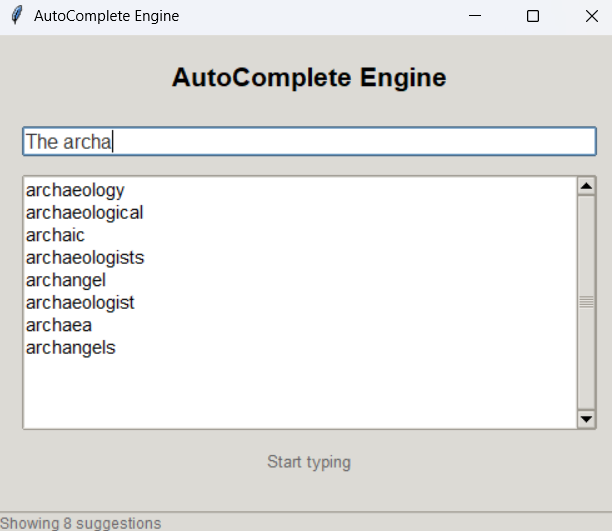

# Autocomplete Engine

## Overview
The GUI-Based Autocomplete System is a Python application that reduces spelling mistakes by suggesting correctly spelled words in real time. Users don’t need to type full words. The system quickly predicts and completes them allowing users to focus on content rather than typing every letter. It is powered by a Trie data structure with frequency-aware ranking ensuring fast and accurate word predictions, designed with OOP principles and features a Tkinter-based user-friendly interface, making it both efficient and easy to use.


## Features
- Real-time autocomplete while typing in the entry field
- Click-to-complete suggestions
- Can be customized with domain-specific dictionaries
- Interactive GUI built with Tkinter
- Trie-based word storage for efficient insertions and prefix lookups
- Frequency-aware ranking using heapq to show top suggestions
- Modular OOP design
  

## Installation
Ensure you have Python 3.7+ installed
1. Clone the repository
```bash
git clone https://github.com/rahmaaref/Autocomplete-Engine.git
```
2. Install required dependencies:
```bash
pip install -r requirements.txt
```
3. Run the Application
```bash
python src/app1.py
```


## Tech Stack
- Python
- Tkinter (GUI)
- CSV Dataset  


## Implementation
- OOP:
  - Trie classes demonstrate encapsulation + abstraction.
  - GUI widget customization shows inheritance + polymorphism.
  - Together, they make the code modular, reusable, and easier to maintain.
- Data Structures: Trie, Dictionary, Heap
- Algorithms: Prefix Search, Top-k Ranking

  
## Screenshots



